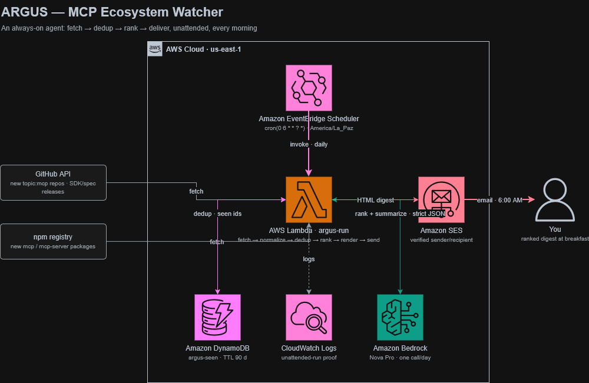

# ARGUS — MCP Ecosystem Watcher

An always-on personal agent that watches the Model Context Protocol ecosystem so you don't have to. Every morning at 6 AM it sweeps GitHub (new `topic:mcp` repos + releases on a curated watchlist) and npm (new MCP packages), throws out everything it has already shown you, asks Amazon Bedrock (Nova Pro) to rank and summarize what's genuinely worth your attention, and drops a sectioned digest in your inbox.

The best version of this tool is one you never open — the answer is just waiting for you at breakfast.

Built for the **AWS Builder Center Weekend Agent Challenge**.

## Architecture

Daily flow: EventBridge Scheduler invokes the `argus-run` Lambda, which fetches from GitHub and npm, skips everything already seen (DynamoDB), has Bedrock Nova Pro rank and summarize what's left, and emails the digest via SES. CloudWatch Logs records every unattended run. Diagram source: [`architecture.drawio`](architecture.drawio).

## Repo layout

- `src/argus_run.py` — the entire agent: fetchers, dedup, Bedrock call, renderer, SES delivery
- `infra/setup-permissions.ps1` — one-time IAM setup (dev policy + Lambda execution role + scheduler role)
- `infra/iam/*.json` — least-privilege policy documents, everything scoped to `argus-*` resources

## Deploy (summary)

1. `.\infra\setup-permissions.ps1 -IamUserName <cli-user>` (once, with admin credentials)
2. Create the `argus-seen` DynamoDB table (pk/sk, pay-per-request, TTL on `ttl`)
3. Verify sender/recipient email in SES (sandbox is fine)
4. Zip `src/argus_run.py` → create Lambda `argus-run` (Python 3.12, role `argus-lambda-role`, env vars `SENDER_EMAIL`, `RECIPIENT_EMAIL`, `TABLE_NAME`, `MODEL_ID`)
5. Create EventBridge schedule `argus-daily`: `cron(0 6 * * ? *)`, timezone `America/La_Paz`, target `argus-run`

Bedrock note: serverless foundation models now auto-enable on first invoke — no console model-access step needed.

## Cost

Effectively free. Lambda/DynamoDB/SES/Scheduler all sit inside Free Tier at this volume; the single daily Nova Pro call costs well under a cent.
